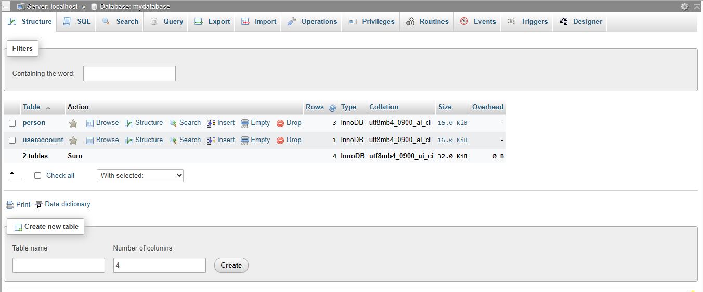
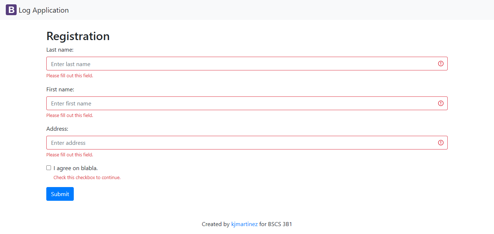
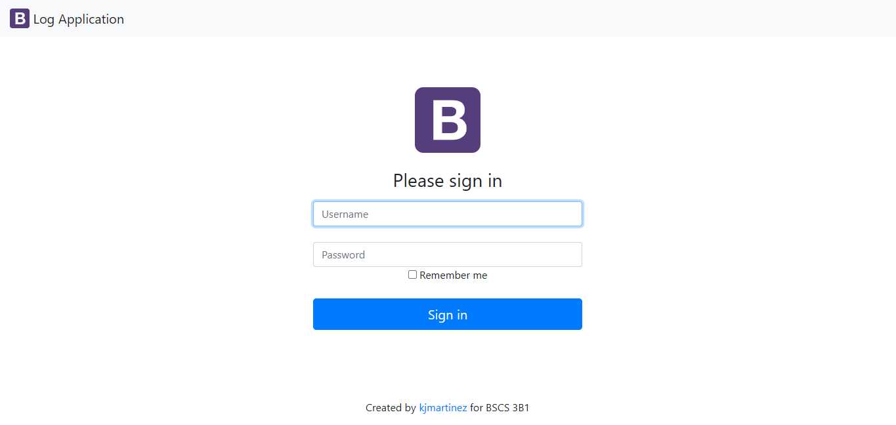
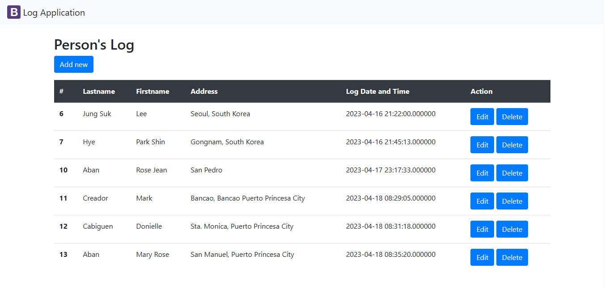

# logApp-scaling-octo
# logApp-scaling-octo

This repo is for Practice Set 5-06

# Name
## Rose Jean Aban

# Description
    A   "logging application," is a type of software tool that is designed to accessing the list of the guest you will able to see or keep track of types of data such as the names, date and time, address of the guests.

# Visuals

### __Installation__

    - Preparation in your database, this will create you first for your database name included in your project by filling your database password and database host etc.

### __Register__

    - In this case, this is you can add data into your database, you will see your data after the registration in the guest list page.
 
### __Login__

    - This will able you to log in using your personal data.

### __Guest__

    - You will see there the guest list after the registration and they will automatically save their information on the guest list.

## Author
I am still learning for this project and I have many errors encountered and that will challenge you to analyze the code and to understand that you need to focus and look for the solution although, I am still having a hard times learning this kind of project that I need to search more about it.

